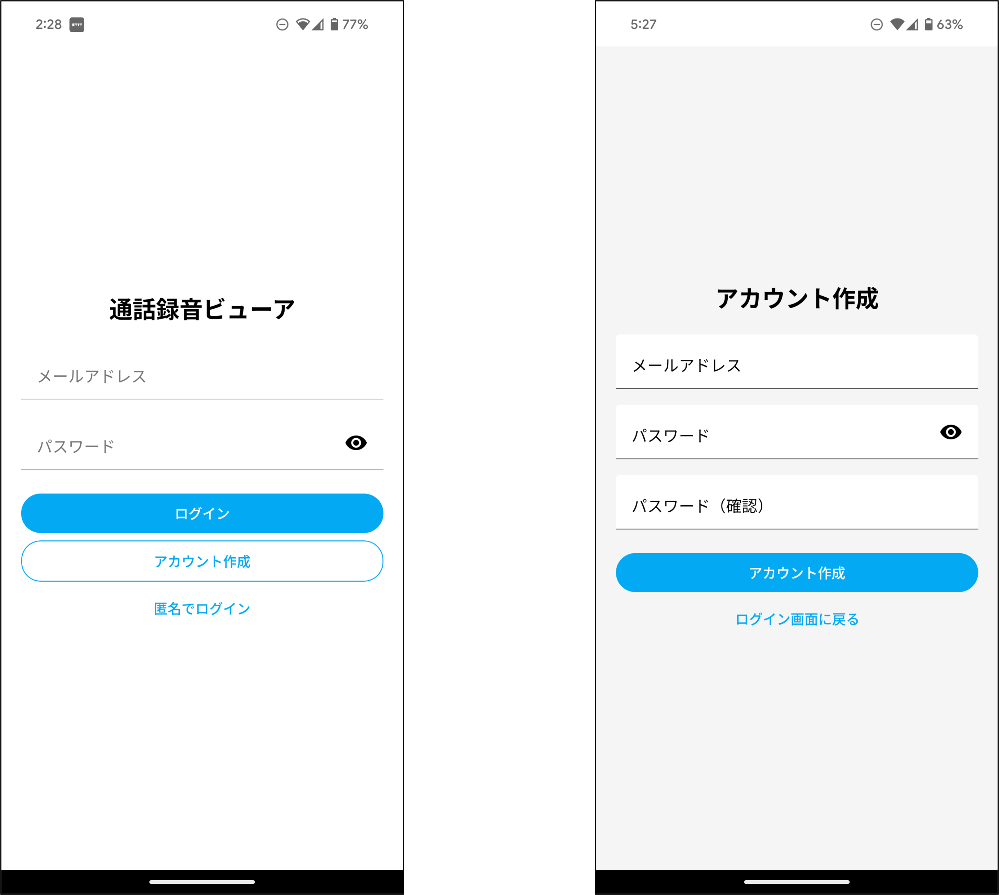
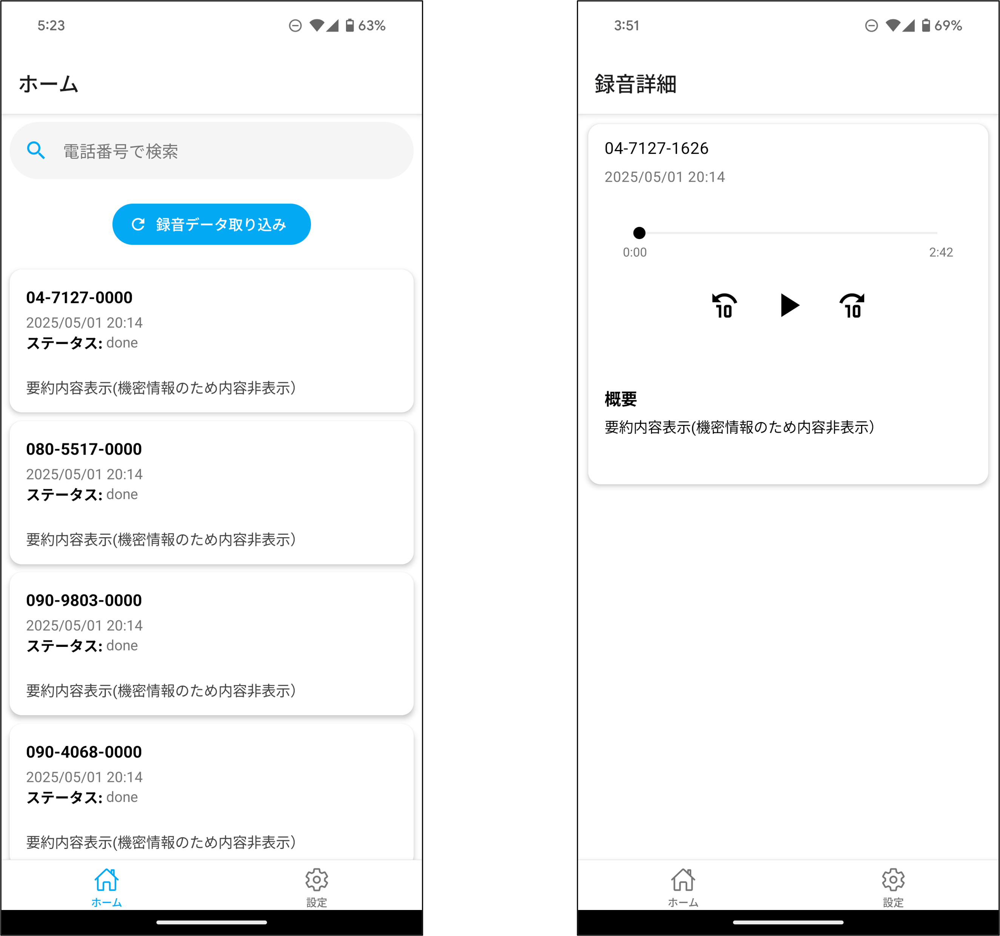
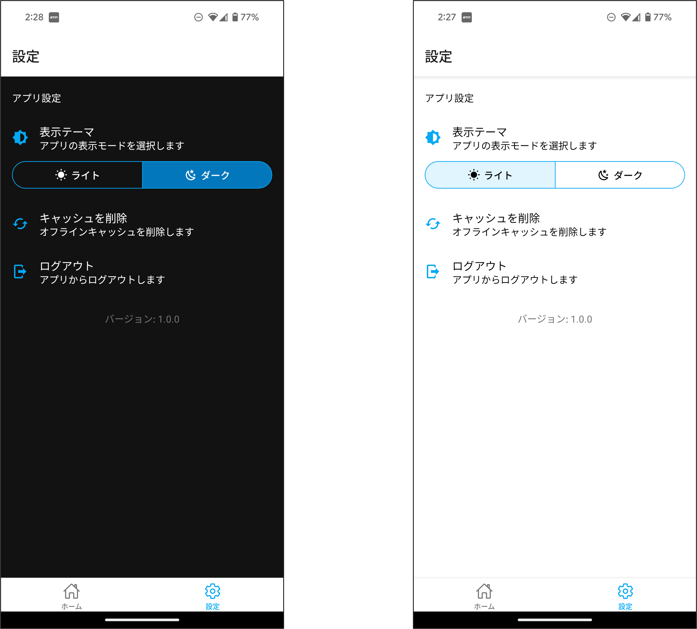

# ACR (React Native Call Recorder Viewer)

## 概要
ACRは、Cloud Run＋Firestore＋Firebase Storageに保存された通話録音データを、React Nativeアプリで一覧表示・再生・文字起こし・要約閲覧できるアプリケーションです。

## 主な機能
- Firebase Authenticationによるログイン
- 録音一覧の取得・表示
- 詳細画面での再生、文字起こし全文、要約表示
- オフラインキャッシュ（直近20件）

## アプリケーション画面紹介

### ログイン・アカウント作成画面


### 通話録音確認画面
電話をすると自動的にデータが処理され追加されていきます。録音データ取り込みを押すことで、取得できていなかったデータも取得できます。



### ダークモード画面


## 対象プラットフォーム
- Android (API 21+)
- iOS (12+)

## 対象ユーザー
- コールセンターオペレーター
- 営業担当者

## 技術スタック
- フレームワーク: React Native 0.71+
- 言語: TypeScript
- UIライブラリ: React Native Paper, React Native Elements
- ナビゲーション: React Navigation v6
- 状態管理: Recoil, React Query
- バックエンド: Firebase SDK (Auth, Firestore, Storage)
- オーディオ: Expo AV, react-native-track-player
- ロギング: Sentry RN SDK
- テスト: Jest, Detox

## アーキテクチャ
- パターン: MVVM-like
- レイヤー構成:
  - features -> hooks -> components
  - services: Firebase SDK呼び出し集中管理

## ディレクトリ構造
```
├── components/     # 汎用コンポーネント
├── features/       # 機能別のロジック・UI
│   ├── auth/      # 認証画面
│   ├── recordings/# 一覧・詳細画面
│   └── settings/  # 設定画面
├── hooks/         # カスタムフック
├── services/      # Firebase初期化 & APIラッパー
├── navigation/    # React Navigation設定
├── store/         # Recoil/React Query設定
├── utils/         # ユーティリティ関数
└── App.tsx        # ルートエントリ
```

## 開発環境のセットアップ
1. リポジトリのクローン
```bash
git clone https://github.com/nishimoto265/ACR-app.git
cd ACR-app
```

2. 依存関係のインストール
```bash
pnpm install
```

3. 環境変数の設定
`.env`ファイルを作成し、必要なFirebase設定を追加

4. 開発サーバーの起動
```bash
pnpm dev
```

## CI/CDパイプライン
- プルリクエスト時:
  - lint (ESLint, Prettier)
  - ユニットテスト (Jest)
- mainブランチマージ時:
  - E2Eテスト (Detox)
  - alphaビルド (Expo EAS)
- リリースタグ時:
  - リリースビルド (Fastlane)

## 今後の機能拡張予定
- 新規録音のプッシュ通知
- 文字起こしと要約の全文検索
- ユーザースコープのフィルター
- アナリティクスダッシュボードとレポート

## ライセンス
[MIT License](LICENSE) 
